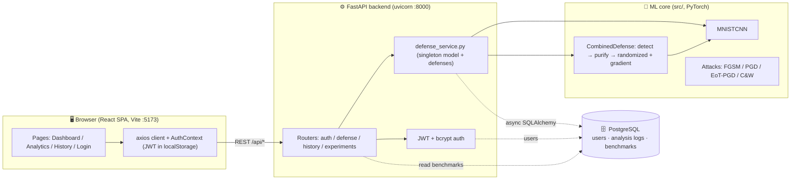
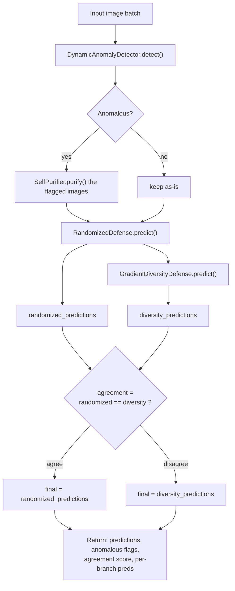
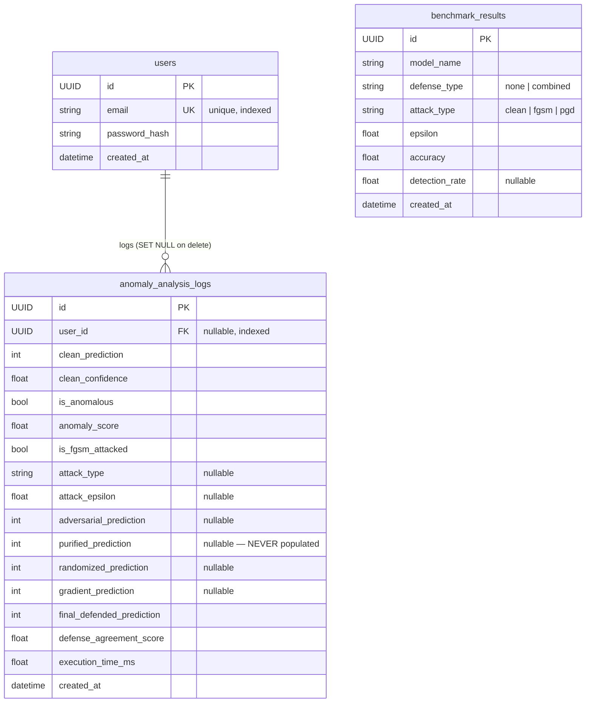
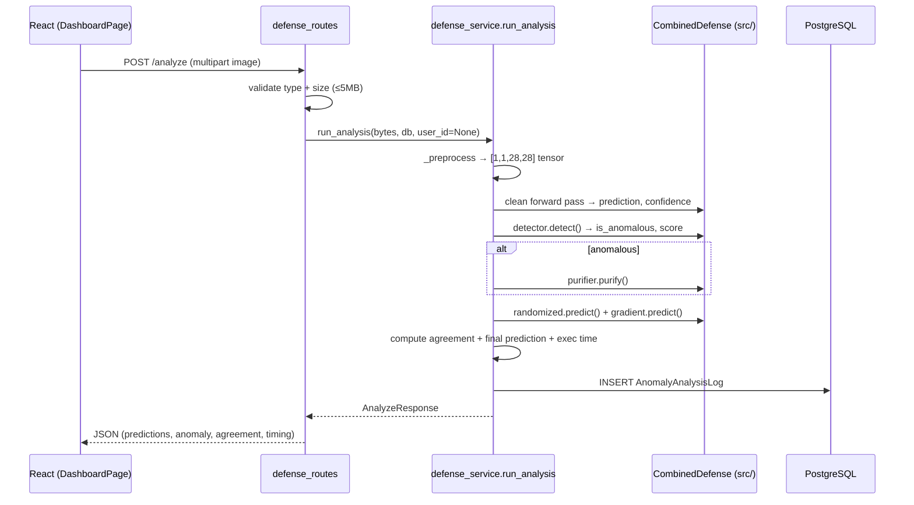
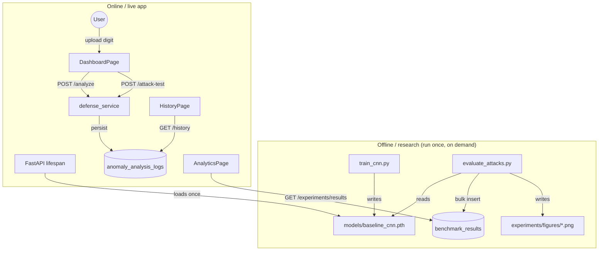

# RealTime Anomaly Defense — Architecture & Handoff Guide

> Deep technical reference for the adversarial-ML defense system: workflow, structure, implementation, and architecture across all three layers (ML core, FastAPI backend, React frontend). Written for an engineer taking over the project cold.

---

## 1. What this project is

This is a **real-time adversarial-attack defense system for image classification**. At its heart is a small CNN that classifies MNIST handwritten digits (0–9). Around that classifier sits a stack of *defenses* that detect and neutralize adversarial perturbations — small, deliberately-crafted pixel changes designed to fool the network into misclassifying an image.

The project has three distinct layers:

1. **ML core (`src/`)** — pure PyTorch. Model definition, adversarial attacks (FGSM, PGD, EoT-PGD, Carlini–Wagner), anomaly detection, image purification, and several defense strategies that combine into one pipeline. This is the research substance of the project (~8,400 lines).
2. **Backend (`backend/`)** — a FastAPI service that wraps the ML core behind a REST API, adds JWT authentication, and persists every analysis to PostgreSQL via async SQLAlchemy (~1,250 lines).
3. **Frontend (`frontend/`)** — a React + Vite single-page app that lets a user upload a digit image, run the defense pipeline live, launch attacks against their own image, and browse historical results and benchmark charts (~1,400 lines).

### Origin story (important context)

The project began as a **Streamlit research app** and was later rewritten into the current FastAPI + React stack. Evidence you'll find in the code:

- The root `requirements.txt` still lists `streamlit`, `opencv-python`, `matplotlib`, `scikit-learn`, `pandas`, `tqdm` — the original research/dashboard dependencies.
- `backend/app/services/defense_service.py` carries the comment *"Replicates the Streamlit preprocessing pipeline."*
- `src/attacks/evaluate_attacks.py` references *"a root-level `app.py` (the legacy Streamlit entry point)"*.
- The `dashboard/` and `notebooks/` directories exist but are now empty placeholders.

So: **`src/` is the shared research core; `backend/` + `frontend/` are the newer production surface built on top of it.** When something looks duplicated between them (e.g. defense configuration constants), that's why.

---

## 2. High-level architecture



The three layers are cleanly separated. The **only bridge** between the web stack and the ML core is `backend/app/services/defense_service.py`, which adds the repo root to `sys.path` and imports directly from `src/`. Everything the API can do to a model flows through that one file.

---

## 3. Repository layout

```
RealTime-Anomaly-Defense/
├── config.py                  # Root research config (paths, hyperparams, seeds, device)
├── requirements.txt           # Research deps (torch, streamlit, opencv, sklearn, ...)
├── .gitignore                 # Ignores .venv, *.pth, data/raw, experiments/*
│
├── src/                       # ── ML CORE (pure PyTorch, ~8,400 LOC) ──
│   ├── models/
│   │   ├── cnn.py             # MNISTCNN (the classifier the whole system defends)
│   │   ├── cifar10_cnn.py     # CIFAR-10 variant (not used by the API)
│   │   └── train_cnn.py       # Training entry point → models/baseline_cnn.pth
│   ├── attacks/
│   │   ├── fgsm.py            # Fast Gradient Sign Method (single step)
│   │   ├── pgd.py             # Projected Gradient Descent (iterative)
│   │   ├── eot_pgd.py         # Expectation-over-Transformation PGD (adaptive)
│   │   ├── cw.py             # Carlini–Wagner L2 attack
│   │   └── evaluate_attacks.py# Benchmark runner + PostgreSQL seeder
│   ├── detection/
│   │   └── anomaly_detector.py# DynamicAnomalyDetector (the "is this adversarial?" gate)
│   ├── purification/
│   │   ├── purifier.py        # SelfPurifier (pick highest-confidence smoothed variant)
│   │   └── dip_purifier.py    # Deep Image Prior purifier (heavy, eval-only)
│   ├── defenses/
│   │   ├── randomized_defense.py    # RandomizedDefense (noise-averaged prediction)
│   │   ├── gradient_diversity.py    # GradientDiversityDefense (transform consistency)
│   │   ├── combined_defense.py      # CombinedDefense (the live pipeline)
│   │   └── defense_pipeline.py      # AnomalyDefensePipeline (simpler; eval-only)
│   ├── data/                  # MNIST loader, preprocessing, dataset, visualization, CIFAR-10
│   ├── evaluation/            # Ablation studies, figure/result generators, GMDCN eval, CIFAR eval
│   ├── optimization/          # Swarm optimizers (SSA, Cuckoo Search) & tuning scripts
│   └── utils/
│
├── backend/                   # ── FASTAPI SERVICE (~1,250 LOC) ──
│   ├── app/
│   │   ├── main.py            # App factory, lifespan (loads model once), CORS, routers
│   │   ├── config.py          # Pydantic Settings (.env-driven)
│   │   ├── database.py        # Async engine, session factory, get_db dependency
│   │   ├── models.py          # SQLAlchemy ORM: User, AnomalyAnalysisLog, BenchmarkResult
│   │   ├── schemas.py         # Pydantic request/response models
│   │   ├── auth/
│   │   │   ├── jwt_handler.py # Token create/decode + get_current_user dependency
│   │   │   └── security.py    # bcrypt hash/verify
│   │   ├── services/
│   │   │   └── defense_service.py  # ⭐ THE BRIDGE to src/ (singletons + orchestration)
│   │   └── routers/
│   │       ├── auth_routes.py       # /api/auth/register, /login, /me
│   │       ├── defense_routes.py    # /api/defense/analyze, /analyze/authenticated, /attack-test
│   │       ├── history_routes.py    # /api/history, /api/history/{id}
│   │       └── experiments_routes.py# /api/experiments/results
│   ├── alembic/               # DB migrations (initial schema: ec6dbe6ac659)
│   ├── requirements.txt       # Web deps (fastapi, sqlalchemy, alembic, torch, ...)
│   └── .env.example           # DATABASE_URL, JWT_SECRET_KEY, CORS_ORIGINS
│
├── frontend/                  # ── REACT SPA (Vite, ~1,400 LOC) ──
│   ├── src/
│   │   ├── main.jsx           # BrowserRouter > AuthProvider > App + Toaster
│   │   ├── App.jsx            # NavBar + Routes
│   │   ├── api/client.js      # axios instance + JWT interceptors
│   │   ├── context/AuthContext.jsx  # Auth state, localStorage rehydration
│   │   ├── pages/             # Dashboard, Analytics, History, Login, Register
│   │   └── components/        # ImageUploader, MetricCard, DefenseStatusBadge,
│   │                          #   PipelineStepTracker, EpsilonSlider
│   ├── vite.config.js         # Dev server :5173, proxies /api → :8000
│   ├── tailwind.config.js     # Brand palette, fonts
│   └── package.json
│
├── models/                    # Trained checkpoints (gitignored, present locally)
│   ├── baseline_cnn.pth       # MNIST CNN — the one the API loads
│   ├── graddiv_cnn.pth        # Gradient-diversity-trained variant
│   ├── gmdcn_cnn_clip.pth     # GMDCN model trained with gradient clipping
│   ├── fashion_mnist_cnn.pth  # Fashion-MNIST trained checkpoint
│   └── cifar10_cnn.pth        # CIFAR-10 model
│
├── data/                      # raw/ (MNIST idx files), processed/, cifar10/
├── experiments/               # figures/ (PNG charts), results/ (JSON), logs/
├── dashboard/                 # (empty — legacy Streamlit placeholder)
└── notebooks/                 # (empty)
```

---

## 4. The ML core (`src/`)

This is where the research lives. It has **no knowledge of the web stack** — pure PyTorch, driven by the root `config.py`.

### 4.1 The classifier — `src/models/cnn.py`

Everything defends this one small network, `MNISTCNN`:

```
Input: [N, 1, 28, 28]  (grayscale digit)

features:
  Conv2d(1 → 32, kernel 3×3, padding 1) → ReLU → MaxPool2d(2)   # 28×28 → 14×14
  Conv2d(32 → 64, kernel 3×3, padding 1) → ReLU → MaxPool2d(2)  # 14×14 → 7×7

classifier:
  Flatten                          # 64 × 7 × 7 = 3136
  Linear(3136 → 128) → ReLU → Dropout(0.25)
  Linear(128 → 10)                 # logits over 10 digit classes
```

It's deliberately tiny — the interesting part is the defenses, not the backbone.

### 4.2 Attacks — `src/attacks/`

An **attack** takes the model, a batch of images, and their true labels, and returns perturbed images that try to cause misclassification. All operate in `[0, 1]` pixel space and clamp back into it.

| File | Function | Idea | Key params |
|------|----------|------|-----------|
| `fgsm.py` | `fgsm_attack(model, images, labels, epsilon)` | Single step: `x + ε·sign(∇ₓ loss)` | `epsilon` |
| `pgd.py` | `pgd_attack(model, images, labels, epsilon=0.2, alpha=0.01, steps=10)` | Iterative FGSM with random start, projected back into the ε-ball each step | `epsilon, alpha, steps` |
| `eot_pgd.py` | `eot_pgd_attack(..., epsilon=0.2, alpha=0.01, steps=10, eot_samples=4)` | **Adaptive** PGD that averages the gradient over several noisy transforms (`eot_transform`, `noise_std=0.03`) so it survives randomized defenses | `eot_samples`, `noise_std` |
| `cw.py` | `carlini_wagner_attack(model, images, labels, targeted=False, c=1.0, kappa=0.0, lr=0.01, steps=100)` | Optimization-based L2 attack in tanh space, Adam optimizer, tracks best-L2 adversarial per image | `c, kappa, steps` |

**Why EoT-PGD matters for this project:** the defenses below rely partly on random noise. A naive attacker who doesn't account for that noise gets defeated by it. EoT-PGD explicitly optimizes *through* the noise, so it's the honest stress-test of the randomized defense. FGSM and PGD are the "standard" threat model; C&W is the strong L2 baseline.

### 4.3 Anomaly detection — `src/detection/anomaly_detector.py`

`DynamicAnomalyDetector(model, threshold_percentile=95.0)` decides **whether an input looks adversarial** before the system trusts the raw prediction. It computes a scalar anomaly score as a weighted blend of three signals:

```
anomaly_score = 0.50 · low_confidence
              + 0.30 · prediction_change
              + 0.20 · confidence_change
```

- **low_confidence** — `1 − max_softmax_prob`. Adversarial inputs often sit near a decision boundary.
- **prediction_change** — does the predicted class flip after light 3×3 average-pool smoothing? Adversarial perturbations are fragile; clean images are stable.
- **confidence_change** — how much the top confidence moves after that same smoothing.

Methods: `_get_statistics` (extracts the three signals), `calibrate` (sets the threshold from a percentile over clean data), `detect` (returns per-image boolean + score), `get_threshold`. The live system uses a **pre-calibrated threshold of `0.037860`** (see §5.3) rather than calibrating at startup.

### 4.4 Purification — `src/purification/`

**`SelfPurifier(model)` (`purifier.py`)** — the lightweight, production-used purifier. Given an image it generates four candidates:

```
[ original,
  3×3 average-pool smoothed,
  5×5 average-pool smoothed,
  denoised = clamp(0.7·smoothed_3×3 + 0.3·original, 0, 1) ]
```

`purify()` runs all four through the model and returns the single candidate with the **highest softmax confidence** — the intuition being that smoothing washes out adversarial noise and the model becomes confident again on the "cleaned" version. `purify_with_details()` returns the chosen image, its prediction, confidence, and which candidate index won.

**`DIPPurifier` (`dip_purifier.py`)** — a much heavier Deep Image Prior approach. `DIPNetwork(channels=32)` is re-initialized and trained per image (300 iterations, LR 0.005, MSE + total-variation loss) to reconstruct a clean version. It's **eval/research only** — far too slow for the request path — but it's here for benchmark comparisons.

### 4.5 Defenses — `src/defenses/`

Three individual defenses plus the orchestrator:

**`RandomizedDefense(model, num_samples=8, noise_std=0.03)`** — `predict()` adds Gaussian noise to the input `num_samples` times, softmax-averages the outputs, and argmaxes. Averaging over noise smooths out adversarial spikes. `predict_with_variance()` also reports prediction stability. *(The live backend constructs it with `num_samples=4` for latency — see §5.3.)*

**`GradientDiversityDefense(model, consistency_threshold=0.75)`** — runs the image through four fixed transforms (original, 3×3 average, 5×5 average, a sharpen filter) and checks whether the predictions agree. `analyze()` measures agreement against the original prediction; `predict()` returns the **majority-vote** class as `final_predictions`. Low agreement is itself a signal that the input is adversarial.

**`CombinedDefense(model, detector, purifier, randomized_defense, gradient_defense)` (`combined_defense.py`)** — the pipeline the API actually serves. Its `predict()` orchestrates:



In code the final selection is `final_predictions = torch.where(agreement, randomized_predictions, diversity_predictions)`.

> ⚠️ **Handoff quirk #1 — comment/code mismatch.** An inline comment in `combined_defense.py` says *"Otherwise use the randomized prediction"* on disagreement, but the code actually falls back to **`diversity_predictions`** when the two branches disagree. The code is what runs; treat the comment as stale. Worth deciding which behavior is intended and aligning them.

**`AnomalyDefensePipeline(model, detector, purifier)` (`defense_pipeline.py`)** — a simpler detect → purify → classify pipeline. It is **not used by the API** (the backend uses `CombinedDefense`); it appears to be an earlier/evaluation-only variant. Don't confuse the two.

---

## 5. Training & evaluation workflow

The ML core is driven entirely by the **root `config.py`**, which centralizes every path and hyperparameter:

```
Paths:    DATA_DIR=data/raw, MODEL_DIR=models,
          RESULTS_DIR=experiments/results, FIGURES_DIR=experiments/figures
Dataset:  NUM_CLASSES=10, IMAGE_SIZE=28, CHANNELS=1
Training: BATCH_SIZE=128, LEARNING_RATE=0.001, EPOCHS=5, RANDOM_SEED=42
Attacks:  FGSM_EPSILON=0.2, PGD_EPSILON=0.2, PGD_ALPHA=0.01, PGD_STEPS=10
Device:   cuda if available else cpu
```

### 5.1 Training — `src/models/train_cnn.py`

Seeds everything (42), loads MNIST via `src/data/mnist_loader.load_mnist`, wraps it in `MNISTDataset`, trains `MNISTCNN` for 5 epochs with Adam + cross-entropy, prints train/test accuracy per epoch, and saves the weights to `models/baseline_cnn.pth`. That checkpoint is exactly what the backend loads at startup.

### 5.2 Evaluation & DB seeding — `src/attacks/evaluate_attacks.py`

This script does double duty and is the **source of the Analytics page's data**:

1. Loads `baseline_cnn.pth` and builds a `CombinedDefense` configured *identically to the live backend* (`build_combined_defense`, threshold `0.037860`, randomized `num_samples=4`, gradient threshold `0.75`) so benchmark numbers match what the API serves.
2. Measures **undefended** accuracy on clean images and under FGSM & PGD at ε ∈ {0.05, 0.10, 0.20}.
3. Measures **defended** accuracy + detection rate through `CombinedDefense` for the same conditions (capped at `COMBINED_DEFENSE_MAX_BATCHES = 20` batches, because the combined pipeline does 10+ forward passes per batch and a full 10k-image sweep is slow on CPU).
4. Queues each result and **bulk-inserts all rows into the PostgreSQL `benchmark_results` table** in a single async session (`_flush_all_to_db`). To do this it inserts `backend/` onto `sys.path` and imports `app.database.AsyncSessionLocal` and `app.models.BenchmarkResult`.
5. Writes a `clean_fgsm_pgd_comparison.png` visualization to `experiments/figures/`.

So the loop is: **train → evaluate (seeds DB) → the frontend Analytics page reads those rows via `/api/experiments/results`.** If the Analytics page shows "No Benchmark Data Found", the fix is literally to run `python src/attacks/evaluate_attacks.py` from the repo root (the empty-state UI even says so).

### 5.3 Headline research results

The committed `experiments/results/project_results.json` records the full-scale numbers (these are the research results, distinct from the 20-batch subset that seeds the live table):

| Condition | ε=0.05 | ε=0.10 | ε=0.20 |
|-----------|:------:|:------:|:------:|
| **Baseline clean accuracy** | — | — | **98.94%** |
| FGSM — undefended | 95.75 | 86.99 | 40.38 |
| FGSM — full defense | 96.18 | 90.04 | **59.45** |
| PGD — undefended | 95.02 | 84.08 | 62.41 |
| PGD — full defense | 95.76 | 89.41 | **80.16** |

Adaptive attack (EoT-PGD, ε=0.2): undefended **61.94%** → defended **79.46%**, with a **67.63%** detection rate. The takeaway the app is built to demonstrate: the defense recovers the most accuracy exactly where the attack is strongest (high ε), and it holds up even against the adaptive attacker.

---

## 6. The backend (`backend/`)

### 6.1 Startup & the singleton model — `main.py` + `defense_service.py`

FastAPI's **lifespan** hook loads the model exactly once, at boot, and reuses it for every request:

```mermaid
sequenceDiagram
    participant U as uvicorn
    participant M as main.py (lifespan)
    participant S as defense_service._load_once()
    participant SRC as src/ (PyTorch)

    U->>M: start app
    M->>S: _load_once()
    S->>SRC: MNISTCNN().load_state_dict(baseline_cnn.pth); eval()
    S->>SRC: DynamicAnomalyDetector(model); threshold = 0.037860
    S->>SRC: SelfPurifier(model)
    S->>SRC: RandomizedDefense(model, num_samples=4, noise_std=0.03)
    S->>SRC: GradientDiversityDefense(model, consistency_threshold=0.75)
    S-->>M: singletons ready (module-level globals)
    M-->>U: app ready to serve /api/*
```

`defense_service.py` is the **only** file that reaches into `src/`. It appends the repo root (`Path(__file__).resolve().parents[3]`) to `sys.path`, holds the model + defenses as module-level singletons, and exposes two async entry points used by the routers:

- **`run_analysis(image_bytes, db, user_id)`** — preprocess → clean prediction/confidence → anomaly detection → (purify if anomalous) → randomized + gradient predictions → agreement → persist an `AnomalyAnalysisLog` → return an `AnalyzeResponse`.
- **`run_attack_test(image_bytes, attack_type, epsilon, db, user_id)`** — preprocess → generate an adversarial example (fgsm/pgd/eot_pgd) → run the same defense pipeline on it → persist → return an `AttackTestResponse`.

`_preprocess()` replicates the original Streamlit pipeline: decode → grayscale → **invert** (MNIST digits are white-on-black; typical uploads are black-on-white) → resize to 28×28 → scale to `[0,1]` → shape `[1, 1, 28, 28]`.

> Notes: the live `RandomizedDefense` uses `num_samples=4` (not the class default of 8) to keep request latency down. The pre-calibrated detector threshold `0.037860` is hard-coded here and mirrored in `evaluate_attacks.py`. Also, `_load_once()` **pins inference to CPU** (`_device = torch.device("cpu")`) regardless of CUDA availability — unlike the research `config.py`, which auto-selects GPU. If you deploy on a GPU box and want the API to use it, change this line.

### 6.2 Configuration — `config.py` (Pydantic Settings)

`Settings` reads from `backend/.env` (see `.env.example`): `DATABASE_URL` (`postgresql+asyncpg://…`), `JWT_SECRET_KEY`, `JWT_ALGORITHM="HS256"`, `ACCESS_TOKEN_EXPIRE_MINUTES=60`, `APP_ENV`, `CORS_ORIGINS`, `MODEL_PATH` (defaults to `repo_root/models/baseline_cnn.pth`), `NUM_CLASSES=10`.

### 6.3 Database — `database.py` + `models.py`

Async SQLAlchemy 2.0 over asyncpg. `database.py` builds the async engine, an `AsyncSessionLocal` factory, the declarative `Base`, and a `get_db()` dependency that **commits on success and rolls back on exception**.



The schema is created by the single Alembic migration `alembic/versions/ec6dbe6ac659_initial_schema.py` (revision `ec6dbe6ac659`, created 2026-08-24).

> ⚠️ **Handoff quirk #2 — dead column.** `anomaly_analysis_logs.purified_prediction` exists in the ORM and migration but is **never written** by `defense_service.py`. The purifier runs, but its standalone prediction isn't persisted. Either wire it up in `run_analysis`/`run_attack_test` or drop the column.

### 6.4 Authentication — `auth/`

- **`security.py`** — `hash_password` / `verify_password` using **bcrypt directly**.
- **`jwt_handler.py`** — `create_access_token(subject, expires_delta)`, `decode_access_token(token)`, and a `get_current_user()` dependency built on `HTTPBearer`. Algorithm HS256, 60-minute expiry.

> ⚠️ **Handoff quirk #3 — dependency drift.** `backend/requirements.txt` lists `passlib[bcrypt]`, but the code uses the `bcrypt` package directly (passlib is unused). It also lists `psycopg2-binary` (a *sync* driver) while the async engine actually needs **`asyncpg`**, which is implied by the `postgresql+asyncpg://` URL but isn't explicitly pinned. Verify `asyncpg` is installed before first run.

### 6.5 API surface

| Method | Path | Auth | Purpose |
|--------|------|:----:|---------|
| POST | `/api/auth/register` | — | Create user (409 on duplicate email; password ≥ 8 chars) |
| POST | `/api/auth/login` | — | Return JWT (401 on bad creds) |
| GET | `/api/auth/me` | ✅ | Current user profile |
| POST | `/api/defense/analyze` | *optional* | Run defense pipeline on an uploaded image |
| POST | `/api/defense/analyze/authenticated` | ✅ | Same, but always attributes the log to the user |
| POST | `/api/defense/attack-test` | ✅ | Generate an adversarial example and defend it |
| GET | `/api/history` | ✅ | Paginated list of the user's analysis logs |
| GET | `/api/history/{log_id}` | ✅ | Single log detail |
| GET | `/api/experiments/results` | — | All `benchmark_results` rows (feeds Analytics) |
| GET | `/health` | — | Liveness check |

File uploads are validated to `png/jpeg/jpg/webp`, max **5 MB**. Attack type is constrained to `fgsm`/`pgd`/`eot_pgd`.

> ⚠️ **Handoff quirk #4 — placeholder auth on `/analyze`.** The public `/api/defense/analyze` endpoint wires its "optional" auth through a no-op placeholder dependency (`lambda credentials=None, db=None: None`), so `user_id` is **always `None`** there — anonymous logs, even if a valid token is sent. Authenticated attribution only happens on `/analyze/authenticated`, which is why the frontend calls that variant when a user is logged in (see §7.3). If you want true optional auth on the public route, replace the placeholder with a real "current user or None" dependency.
>
> ⚠️ **Handoff quirk #5 — unused schema.** `schemas.py` defines `AttackTestRequest` (with `attack_type` Literal and `epsilon` bounds `0 ≤ ε ≤ 1`), but `/attack-test` reads `attack_type` and `epsilon` as multipart `Form` fields instead, so that schema isn't actually enforced on the endpoint. The validation lives in the route handler instead.

### 6.6 Request lifecycle — `/api/defense/analyze`



---

## 7. The frontend (`frontend/`)

React 18 + Vite 5 + Tailwind 3. `vite.config.js` serves on **:5173** and proxies `/api` → `http://localhost:8000`, so in dev there are no CORS headaches.

### 7.1 Composition & routing

`main.jsx` mounts `BrowserRouter > AuthProvider > App` plus a global `Toaster`. `App.jsx` renders a `NavBar` and the routes: `/` → `/dashboard`, `/login`, `/register`, `/dashboard`, `/analytics`, `/history`.

> ⚠️ **Handoff quirk #6 — no route guards.** There is **no route-level auth protection**. `/history` and `/analytics` render regardless of login state; access control is effectively enforced by the API (401s) and the axios interceptor that redirects to `/login`. If you need hard client-side gating, add a protected-route wrapper.

### 7.2 Auth plumbing — `api/client.js` + `context/AuthContext.jsx`

`client.js` is an axios instance whose **request interceptor** attaches `Authorization: Bearer <token>` from `localStorage`, and whose **response interceptor** redirects to `/login` on any 401. `AuthContext` exposes `{ user, token, login, register, logout, isLoading }`, persists the token under the `access_token` key, and rehydrates the session on mount by calling `/api/auth/me`.

### 7.3 Pages

- **`DashboardPage.jsx`** — the main event. Upload an image, click **Analyze** (`POST /api/defense/analyze`, or `/analyze/authenticated` if logged in — this is the frontend side of quirk #4), and see results as `MetricCard`s + a `DefenseStatusBadge`. A second section lets logged-in users pick an attack (fgsm/pgd/eot_pgd) and ε, then **Run Attack Test** (`POST /api/defense/attack-test`). A `PipelineStepTracker` animates the 5 stages.
- **`AnalyticsPage.jsx`** — reads `/api/experiments/results` and renders recharts bar charts (undefended vs defended accuracy by ε, for FGSM and PGD), a detection-rate line chart, summary metric cards, and a raw-records table. Has explicit loading / error / empty states (the empty state tells you to run the eval script).
- **`HistoryPage.jsx`** — paginated table of the user's own logs (`PAGE_SIZE = 15`).
- **`LoginPage.jsx` / `RegisterPage.jsx`** — standard auth forms wired to `AuthContext`.

### 7.4 Components

`ImageUploader` (react-dropzone, PNG/JPEG, 5 MB, preview), `MetricCard` (glassmorphism stat card with success/danger/warning highlight variants), `DefenseStatusBadge` (verdict badge: *Adversarial Detected* / *Low Agreement* / *Defense Stable*, where "agreed" means agreement ≥ 0.75), `PipelineStepTracker` (5-step stepper: Anomaly Detection → Self-Purification → Randomized Defense → Gradient Diversity → Final Prediction), and `EpsilonSlider` (a button group over ε ∈ {0.05, 0.10, 0.20}). Styling comes from `tailwind.config.js` (indigo brand palette, Inter + JetBrains Mono).

---

## 8. End-to-end data flow (full picture)



The two halves meet at `models/baseline_cnn.pth` (produced offline, consumed online) and at the `benchmark_results` table (written by the eval script, read by the Analytics page).

---

## 9. Local development setup

**Prerequisites:** Python 3.10+, Node 18+, a running PostgreSQL instance.

**1. ML core / research env (repo root):**
```bash
python -m venv .venv && source .venv/bin/activate   # (.venv is gitignored)
pip install -r requirements.txt
python src/models/train_cnn.py        # produces models/baseline_cnn.pth (skip if present)
```

**2. Backend:**
```bash
cd backend
pip install -r requirements.txt        # ensure asyncpg is present (see quirk #3)
cp .env.example .env                   # then set DATABASE_URL + JWT_SECRET_KEY
alembic upgrade head                   # create tables
uvicorn app.main:app --reload --port 8000
```

**3. Seed benchmark data (so Analytics isn't empty):**
```bash
# from repo root, with the backend .env / DB reachable
python src/attacks/evaluate_attacks.py
```

**4. Frontend:**
```bash
cd frontend
npm install
npm run dev            # http://localhost:5173, proxies /api → :8000
```

---

## 10. Handoff notes — quirks & gotchas at a glance

These are the things most likely to surprise the next engineer. Details are inline above.

1. **CombinedDefense comment vs code** — on branch disagreement the code uses `diversity_predictions`, not the "randomized" the comment claims (§4.5).
2. **`purified_prediction` column is never populated** — dead field in `anomaly_analysis_logs` (§6.3).
3. **Dependency drift** — `passlib` listed but unused; `psycopg2-binary` listed but the async engine needs `asyncpg` (§6.4).
4. **Placeholder auth on `/api/defense/analyze`** — public route always logs anonymously via a no-op dependency; use `/analyze/authenticated` for attribution (§6.5).
5. **`AttackTestRequest` schema is unused** — the endpoint reads `Form` params instead (§6.5).
6. **No client-side route guards** — protected pages rely on API 401s + axios redirect (§7.1).
7. **Streamlit legacy** — root `requirements.txt`, the "Replicates the Streamlit pipeline" comment, a referenced root `app.py`, and empty `dashboard/`/`notebooks/` dirs are remnants of the original app (§1).
8. **`.gitignore` stray text** — the last line reads `experiments/figures/*git add .` (a `git add .` got pasted onto the pattern). Harmless but worth cleaning; double-check `experiments/figures/` is ignored as intended.
9. **Defended benchmark numbers are a 20-batch subset** — `evaluate_attacks.py` caps `COMBINED_DEFENSE_MAX_BATCHES = 20` for speed, so the live table's defended accuracy is computed on a sample, not the full 10k test set (the full research numbers live in `experiments/results/*.json`). Raise or remove the cap for publication-grade figures (§5.2).
10. **Config duplicated by design** — the live defense parameters (threshold `0.037860`, randomized `num_samples=4`, gradient threshold `0.75`) are hard-coded in *both* `defense_service.py` and `evaluate_attacks.py` so benchmarks match production. Change them in both places or they'll drift.

## 11. Suggested next steps

- Add a top-level **README** pointing at this document (the repo currently has none).
- Resolve quirks #1–#5 (they're all small, self-contained fixes).
- Pin `asyncpg` explicitly and drop `passlib`/`psycopg2-binary` if unused.
- Consider a `ProtectedRoute` wrapper for `/history` and `/analytics`.
- If CIFAR-10 support (`src/models/cifar10_cnn.py`, `cifar10_cnn.pth`) is meant to be exposed, note that the backend currently hard-wires the MNIST model only.
```
